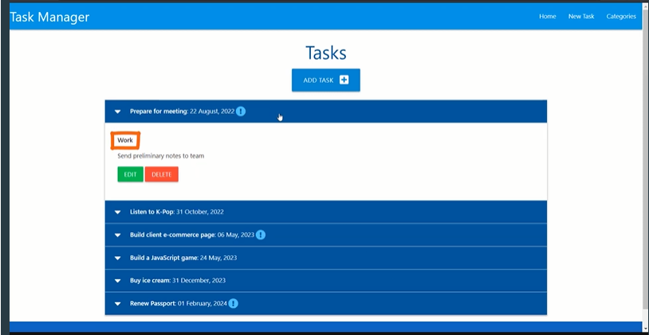
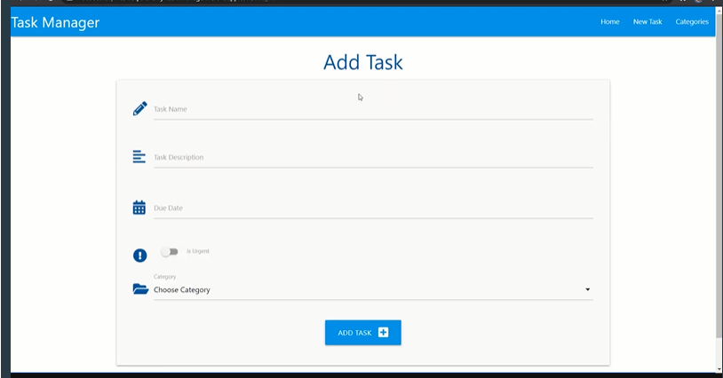

 
This is the Code Institute's workthrough project which represents creating a web application "Task Manager".

# Home Page

The home page of our task manager application displays a summary of tasks.
That summary information consists of the task name, due date, whether or not it's an urgent task,
and once we click to expand more, we see the task category, and a description.

# Edit Task Page

Users will be able to create new tasks, view their tasks, edit tasks, and finally, delete their tasks.
In addition to performing CRUD functionality for tasks, users will also be able to perform
the same thing with various categories.

# Responsive

The app will be fully responsive due to the fact that we will use the Materialize framework grid-based classes.
 
 

## Gitpod Reminders

To run a frontend (HTML, CSS, Javascript only) application in Gitpod, in the terminal, type:

`python3 -m http.server`

A blue button should appear to click: _Make Public_,

Another blue button should appear to click: _Open Browser_.

To run a backend Python file, type `python3 app.py`, if your Python file is named `app.py` of course.

A blue button should appear to click: _Make Public_,

Another blue button should appear to click: _Open Browser_.

In Gitpod you have superuser security privileges by default. Therefore you do not need to use the `sudo` (superuser do) command in the bash terminal in any of the lessons.

To log into the Heroku toolbelt CLI:

1. Log in to your Heroku account and go to *Account Settings* in the menu under your avatar.
2. Scroll down to the *API Key* and click *Reveal*
3. Copy the key
4. In Gitpod, from the terminal, run `heroku_config`
5. Paste in your API key when asked

You can now use the `heroku` CLI program - try running `heroku apps` to confirm it works. This API key is unique and private to you so do not share it. If you accidentally make it public then you can create a new one with _Regenerate API Key_.

------
 

---

Happy coding!
